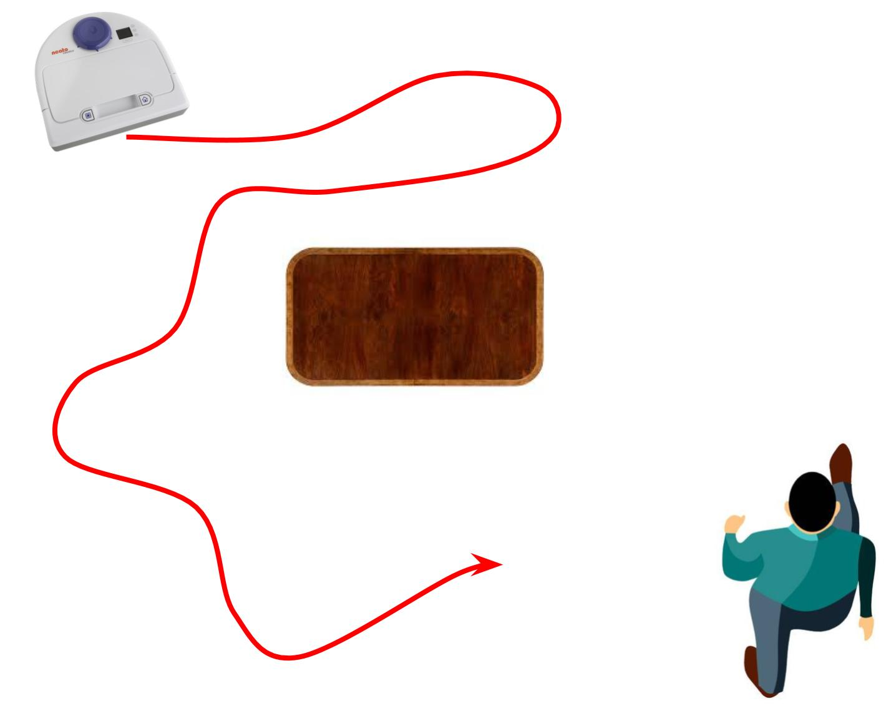
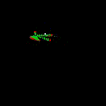
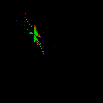
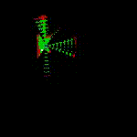
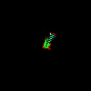
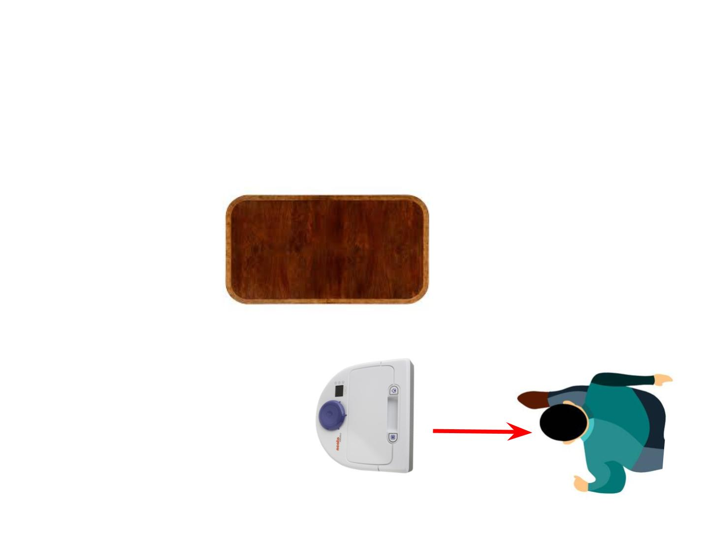
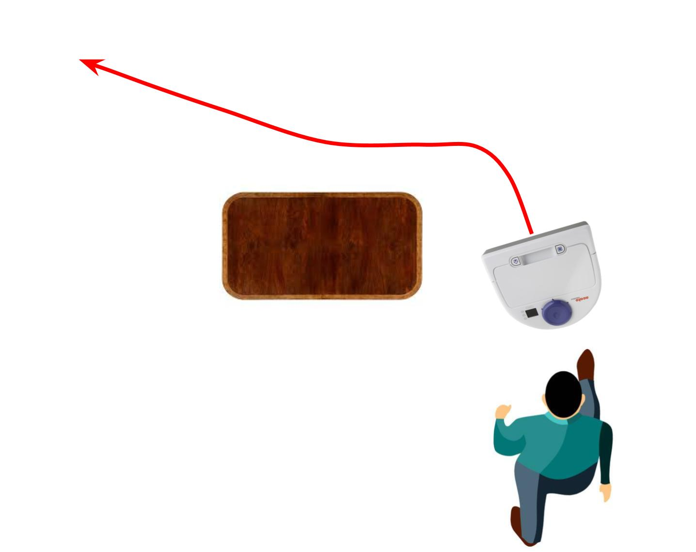
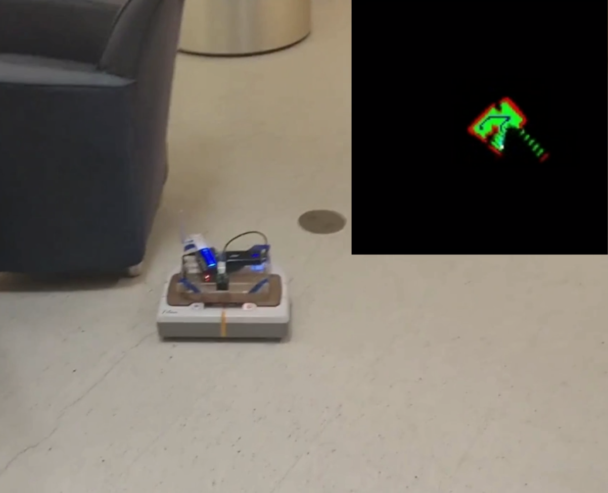
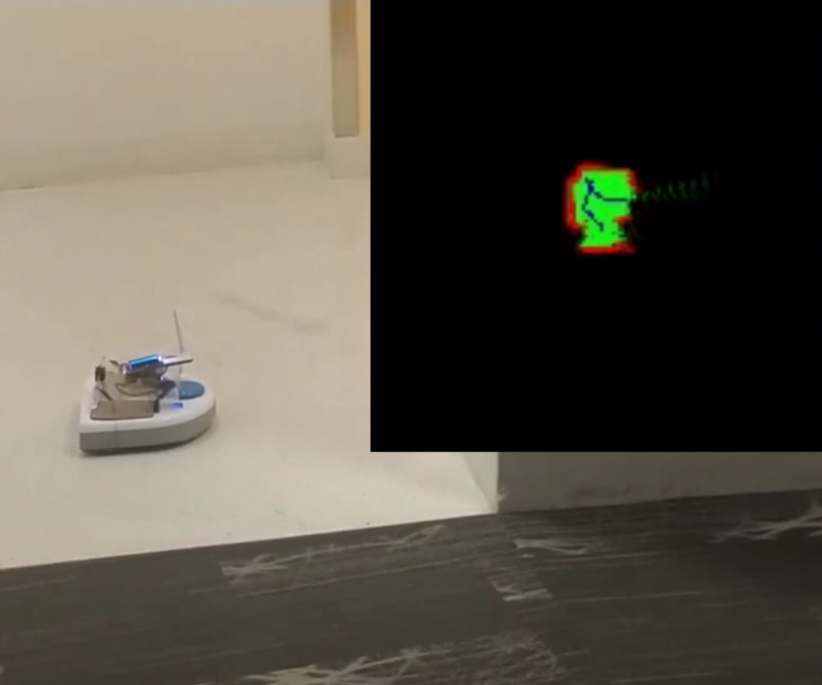

# Overview
The Lassie-bot is a multi-stage environment mapping and person finding feature for the [Neato robot vacuum](https://www.neatorobotics.com/) with connected raspberry pi and camera for Olin ENGR3590. The main purpose of the lassie-bot is given odometry, laser scan, and camera data, explore the environment with the purpose of finding humans in order to lead them back to the starting position. This is based on the canonical behavior where Lassie runs to go find help after seeing someone trapped and returns to their rescue.

For the purposes of implementation, I broke this behavior down into 3 stages: explore, approach, and return.

Check out [blog 1](./story1.html) to see a first pass inplementation of each of these, or read on to see the final implementation.

## Explore

The entire purpose of explore is to find a human. Unfortunately there is no universal metric as to how to achieve this. For the purposes of this project, I decided to define exploration as going to the farthest away places that we have confirmed do not contain an obstacle.

This analysis can still be further broken down into 2 more parts: creation of the environment map and traversal of this map to find good coordinates.

Checkout [blog 2](./story2.html) to see how I went about creating the map.

Here's a look at the mapping in action:

Once I have a (theoretically) sufficient map of the environment, I can do helpful inference on this map with breadth first search algorithms such as [Dijkstra's Algorithm applied to maps ](http://www.roguebasin.com/index.php?title=Dijkstra_Maps_Visualized). This allows me to calculate distances from anything to anything in a varying amount of conditions. For this application, I calculate distance from any viable point to the nearest point where the Neato has been and filter these paths via a minimal threshold distance from the nearest object. The next goal is selected as the furthest away point (within reason, so not too far away) that is not close to an obstacle.

Here's an example of me controlling the Neato while it weights the environment (shown in yellow) and sets a waypoint (shown in white).

Once a goal is decided, the robot can then use another graph traversal algorithm to find the best and safest route to the goal according to the maps the we defined above. The gif belows shows an example of the Neato maneuvering itself to the next goal in order to more explore the map.

Here we have the final implementation of the exploration algorithm. With modifications to the map so it will build confidence in areas over time and and a sparser exploration path, we can see it performs smoother, more intelligent goal setting and achievement. Note that now the bluer points on the graph represent likely place to explore.

## Approach

Since the end goal is to find a person, the entire time the the Neato is exploring its environment it is also scanning its visual data to find someone. Once the Neato has explored enough and located a savior, it must approach the person to get their attention. For this aspect, the first-pass works perfectly fine and the final behavior is the same as described earlier in [blog 1](./story1.html).

**TL;DR**: I implement a proportional controller based on the persons bounding box inside the frame, and decide when to stop based on the size of the person in the frame

## Return

Finally we must return from the current position to the origin of the Neato. Conveniently, this can be easily accomplished by the beautiful map of the environment we have made during this whole process. All we have to do is set a goal of the origin of our robot in the map, find the distance of all relevant points form that goal using a BFS like described before, and then greedily follow the next closer point just like going to any other goal.

## Final Videos
(Click to go to the Youtube videos)

