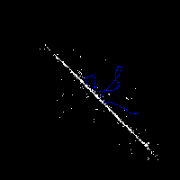
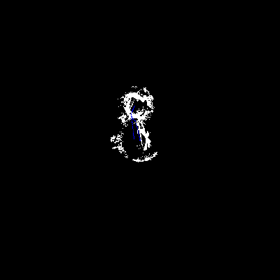
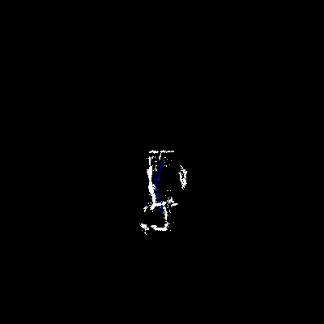
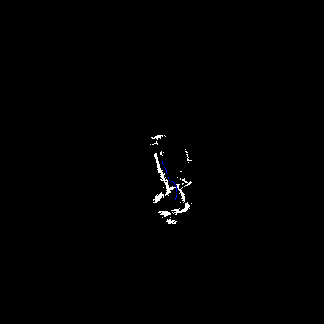
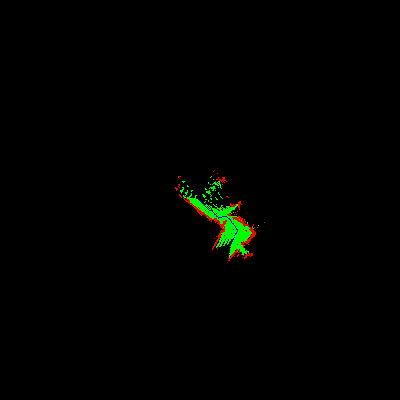

[Main Page](./index.html).
## Story 2: Graph Iteration
After building out and testing the basic architecture I moved onto building out the first
(and most essential part) of the lassie process: The Exploration.

In order to effectively explore your environment you must first understand it. So, I started with
mapping the environment in a 2D graph. I debated using a pre-made library to do this, but
since one of my learning goals is learning more about robotics, I instead decided to do
the environment mapping myself.

### Graph Initialization
The initialization of the 2D map was moderately straightforward. Upon initialization
a new matrix of an appropriate size is defined that represents the surrounding scenery.
For this problem, each 10 x 10 cm block is represented by pixel in the map. When the
map is defined, the position and orientation of the Neato is recorded and a remapping
function between the Neato's coordinate frame and the map is defined.

Once the map is defined we can begin mapping the laser scans into the graphs space
and see what we get.

Huh, not very pretty. In case you were wondering, the Neato was not wandering along
a long wall. This was a particularly nasty bug as it was hard to tell how specifically it was not working. I tested the laser scan quality, scan coordinate mapping, graph mapping function, and every other part of the process to no avail. In the end, I found that it was an indexing error in the last line as follows:

<pre>
How I wanted too index:  
x = [x1,x2,x3,x4,x5]  
y = [y1,y2,y3,y4,y5]

How I accidentally indexed:   
[x1,x2,x3,x4,x5]  
[y1,y2,y3,y4,y5]  
 ^  ^  
 x  y
</pre>

So it was instead plotting the differences between adjacent scans leading to that
ugly graph. With that out of the way I was able to get a semi-reasonable graph
like the one below.

Unfortunately this is still a lot noisier than I would have liked. After some
testing I was able to discover that the errors were coming from a mismatch between
timesteps from laser scans and odometry scan. So, I was mapping the scan from
one time step using the odometry from another. By using a built in  ROS approximate
time synchronous subscriber I was able to enforce that incoming laser scans would
arrive with a temporally close odometry measure, producing results shown below.

Much better right? Then I tuned the parameters of the package such that it
would require a close time matching without it being so close that few laser
scans qualify, producing the even finer results below.

Finally, I further augmented the scan data to include some `open points` that
 exist between the Neato and a detected object and plotted them along side the
 objects, producing this final map that can now be used for inference and
  exploration using graph traversals.

