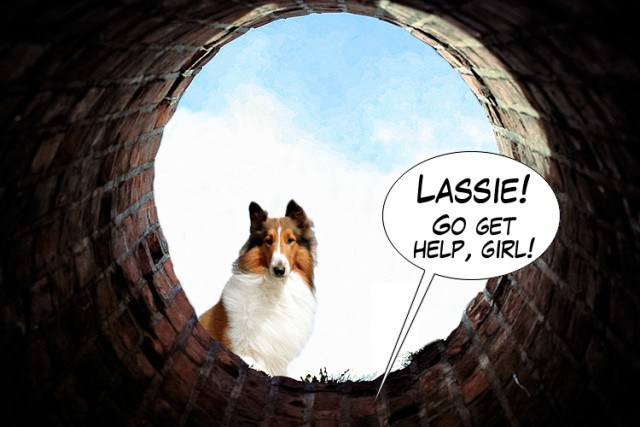

## Lassie Project Proposal

**Who is on the team?**

Nick Steelman

**What is the main idea of the project?
What topics will you explore and what will you generate?**

I want to explore a mix between path planning and machine learning for this project. I plan on building upon my previous person following work, but switch it around so that the person follows the Neato. The main idea is to enable the Neato to see a person at a start location, explore the area for another person, then lead that person back to the start location.   

**What frameworks / algorithms are you planning to explore (do your best to answer this even if things are still fuzzy)? **

I currently know relatively little about path planning so most of my focus will be around that. As far as specifics go I am pretty fuzzy.
There will likely be auxiliary challenges such as object avoidance and realistic exploration as well that I will have to explore.

**What is your MVP?**

My MVP is to enable the Neato in an empty room to have a start location, scan the room for a person, go up to the person, then return to the start location.

I don't expect this will be very difficult.

**What are your stretch goals?**

To me the biggest, difficult extensions to this are the exploration, object avoidance, and path planning. Which should be implemented in the following order:

 Firstly, I need to quantify what it means for the Neato to "look" for someone, which I would like to be more complex than doing a 360 and scanning for bodies.

 Once it can explore and can set waypoints (or directions) to try, it needs to be able to effectively navigate. It should be able to navigate in the correct direction while avoiding minor obstacles (like chairs) and major ones (like walls).

 Finally once it reaches a viable location, it should be able to navigate back in an intelligent way. This means an MVP of retracing its path but likely being able to effectively navigate back as well.

 Also, if I achieve all my learning goals and have extra time I'd like to make the Neato more dog-like and add some visual commands.

**Outline a rough timeline for the major milestones of your project.  This will mainly be useful to refer back to as we move through the project.**

Friday 16th - Basic MVP finished. Will scan for a person, go to them, and lead them to its origin.

Friday 30th - Some form of exploration completed

Friday 7th - Some form of object avoidance completed

Friday 14th - Finishing touches and documentation.

**What do you view as the biggest risks to you being successful on this project?**

I think the MVP will be simple to implement, but I think the extensions area big risk. I don't know very much about approaches to environment navigation so it will heavily depend on how well I can research, understand, and implement modern approaches to that.

**[This section will be completed in class on 11/9] Given each of your YOGAs, in what ways is this project well-aligned with these goals, and in what ways is it misaligned?  If there are ways in which it is not well-aligned, please provide a potential strategy for bringing the project and your learning goals into better alignment.  There should be an individual section for each person on the team addressing the fit between the YOGA and the project topic.**

My YOGA:
* Machine Learning: Since one of my main focuses in my career is around machine learning and deep learning I want it to be an aspect of my final project. I don’t have to create a new model or anything but I want the robot to exhibit some sort of qualitative intelligence that is not hard programmed, since to me these are the most unique and interesting projects.
* Classical Robotics: Since this a a robotics class, I want my project to include a non-trivial classical robotics aspect. One of the key skills I feel I will use in the future is being able to effectively understand different systems and find ways to apply machine learning in those systems and I feel making myself look at more classical robotics challenges will force me to do that.
* Polish: Another major learning goal for me in this class is to learn to polish my projects. This means create projects that work well, are moderately robust, and have good documentation. So I would like my final deliverable to exhibit those properties, even if it means taking a hit to the scope of the project.

I think my learning goals align very well with he project I'm attempting. I think it is definitely a lot more robotics heavy then what I'm particularly used to, which is good. It does have a lot of opportunities for machine learning inside of it and for potential ML extensions. Finally the MVP is pretty low so there is a lot of opportunity to polish the preliminary results.
